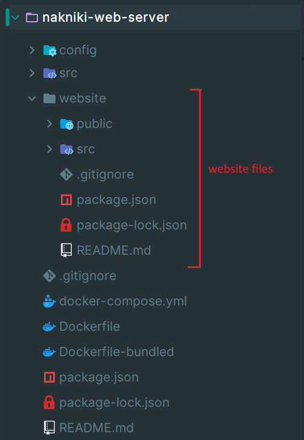

# Nakniki-Netflix - Installation

_Avi Ben David, Eden Shaked, Kfir Eitan._

**This document explains how to run the entire project.**

The system consists of 4 GitHub repositories:
- Recommendation server ([project-netflix](https://github.com/Roky360/project-netflix))
- Web server ([nakniki-web-server](https://github.com/Roky360/nakniki-web-server))
- React website ([nakniki-website](https://github.com/Roky360/nakniki-website))
- Android application ([nakniki-app](https://github.com/Roky360/nakniki-app))

You may also visit our [Jira](https://edenshkd.atlassian.net/jira/software/projects/NP/boards/2/backlog) to find out about our journey of making this project :P

Below are the system requirements to run the project, and how to set up and run each part.
Note that this is a summarized guide focusing on how to run the entire system. For more information, feel free to visit
the readme of each repository.

## Requirements

* Docker Desktop
* MongoDB Server
* Emulated or real Android device with **Android 8.0 or above**

## 1. Recommendation server

Clone the [project-netflix](https://github.com/Roky360/project-netflix) repo with:
```bash
git clone https://github.com/Roky360/project-netflix.git
```

Set a port in the env file that the recommendation server will run on in localhost.
Then, in the root directory, run:
```bash
docker-compose up app -d
```

When finished, the recommendation server should be running with Docker in the background.

## 2. Web server & React website

The web server and the website runs together (the web server serves the website statically).

First, clone the [nakniki-web-server](https://github.com/Roky360/nakniki-web-server) and [nakniki-website](https://github.com/Roky360/nakniki-website)
repositories, with:
```bash
git clone https://github.com/Roky360/nakniki-web-server.git
```
```bash
git clone https://github.com/Roky360/nakniki-website.git
```

### Run MongoDB

Simply make sure that **MongoDB Server** is up and running.

### Setup web-server

Configure an env file to the **web server** by following step 3 in its README file.

### Bundle the website with the web-server

Then, put the React website folder you cloned earlier **inside** the server's folder, and make sure that the website's folder name 
is set to "website" (rename it if needed). Example of that setup:



Now, in the server's folder, run the following command, ensuring that you provide the correct path to the env file you just set up. This command assumes that you use the
".env.example" file that we provided:

```bash
docker-compose --env-file ./config/.env.example up website-bundled -d
```

When finished, the website (and web server) is available at localhost at the port you set.

## 3. Android app

Clone the [nakniki-app](https://github.com/Roky360/nakniki-app) repo with:
```bash
git clone https://github.com/Roky360/nakniki-app.git
```

### Set up web server URL

Set up the web server URL by going to the `strings.xml` file located in `/app/src/main/res/values` folder.
In there, set the "api_base_url" string (should be the second item) to the web server URL, with the addition of `/api/` at the end. 
Also notice that if you intend on running the app on an emulator, write `10.0.2.2` instead of "localhost".

For example, if your web server's port is 12345, and you are running on an emulator, then a valid field will be:
```xml
<string name="api_base_url">http://10.0.2.2:12345/api/</string>
```

And if you run on a real Android device, you will need to get the local IP address of the PC that hosts the web server 
and put it instead of `10.0.2.2` (not recommended for convenience reasons...).

### Create APK

When the web server URL is set, run this command in the root directory of the app:

```bash
docker-compose up apk
```

It may take a while to run, but when finished, it will create an APK file named `app-debug.apk` in the `/app/build/outputs/apk/debug/` folder.
The APK file can be installed on Android device of your choosing. If using an emulator, simply drag the APK file
onto the emulator's screen, this should install it.

Then look for the "Nakniki-Netflix" app on your device, open it and enjoy :D

---

**Now the system should be up and running, and you can start using the website and app using the guides in the "usage"
folder of this wiki.**

We wish you happy Nakniki-time watching movies in our nakniki-website and nakniki-app :)
