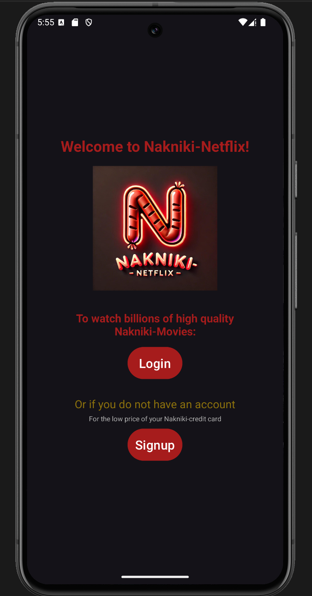
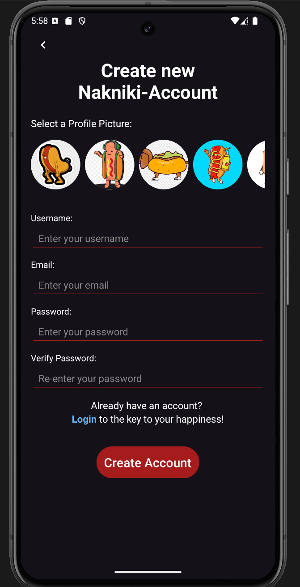
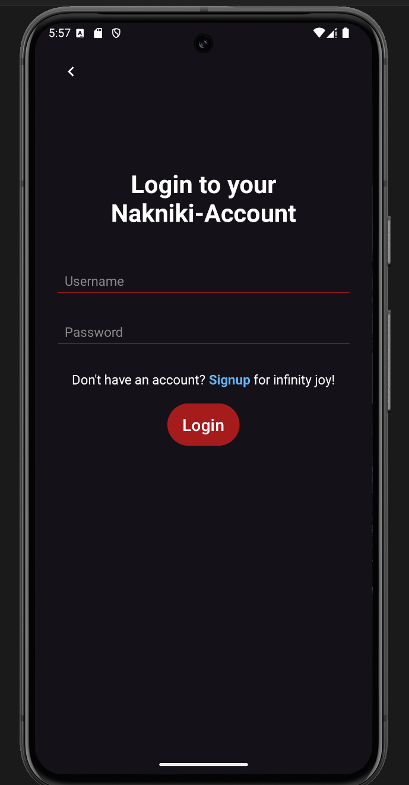
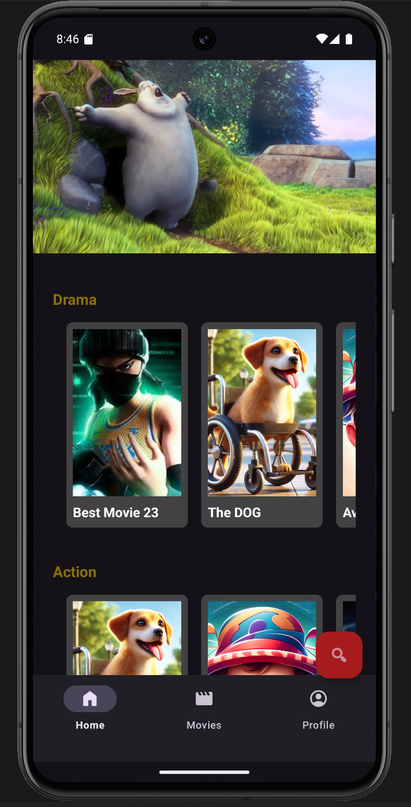
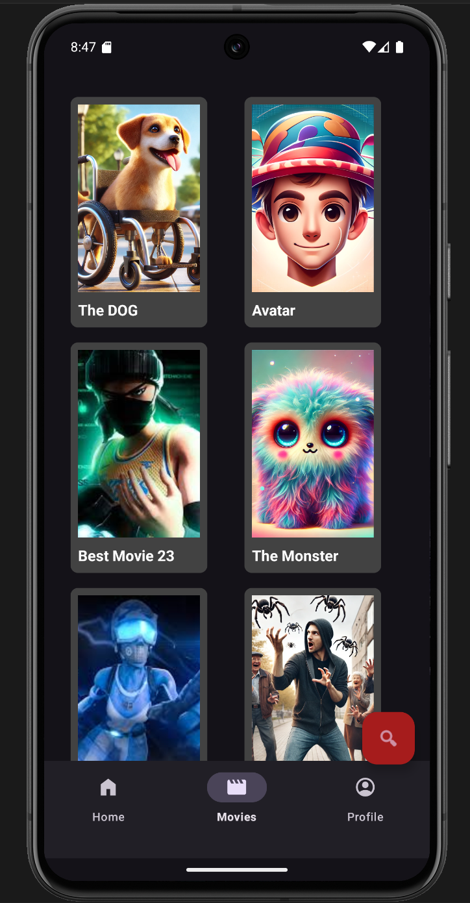
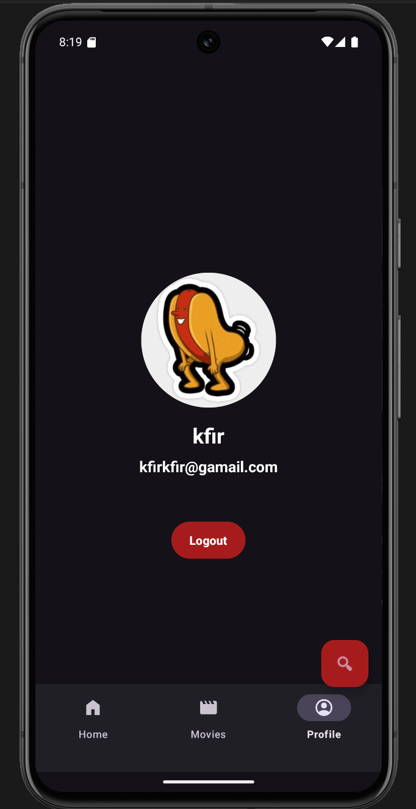
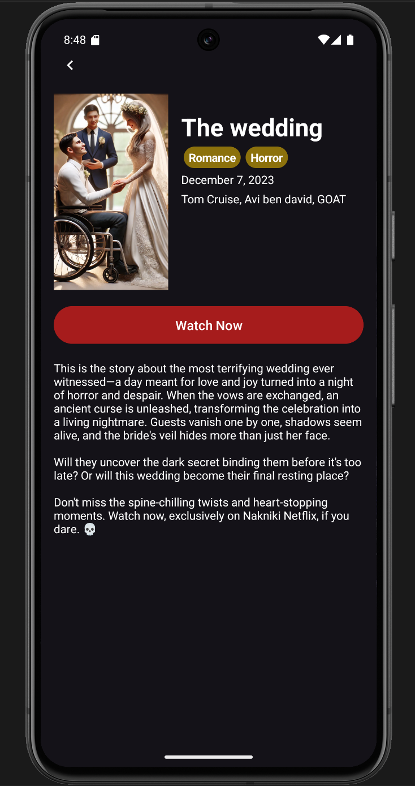
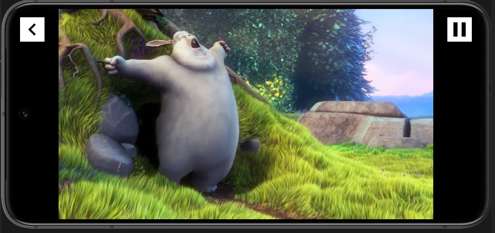
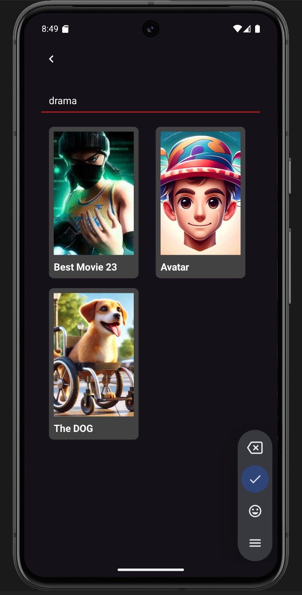

# Nakniki-Netflix Usage - App

Welcome to **Nakniki-Netflix**, a movie-streaming platform designed to provide a seamless user experience for browsing, managing, and watching movies.

This README will guide you through the setup, usage, and core functionalities of **Nakniki-Netflix App**.  

The app's theme color automatically adapts to your phone's system settings, supporting both **light mode** and **dark mode** for a seamless experience.

## Home Screen for unregster User

## User Registration and Login
This guide will walk you through the registration and login process on the Nakniki-Netflix website.

### Signup process
1. Launch the app.
2. Click on the **Signup** button on the main screen.
3. Fill out the registration form:
    * **Choose an Avatar**
    * **Username**
    * **Email**
    * **Password**
4. Submit the form.

* From here you will be transfer to the **Login** page.

note - if you already have an account you can move from here to the Login page.

### Login process
1. Launch the app.
2. Click on the **Login** button on the main screen.
3. Fill out the login form:
    * **Username**
    * **Password**
4. Submit the form.

* From here you will be transfer to the **Home** page.

note - if you dont have an account you can move from here to the Signup page.

## Home page

After the user did the Login, he will enter the Home page for registers users.

In the top of the page there is an automatically player that plays a random movie and when the user scroll down there are movies that their categories are "promoted".  
In this page there is only "promoted" movies.

## Movies page

In this page you can see all the movies that exist in the website.

## User info

When the user click on the profile tab he will enter the profile page.  
There he will see the profile pic, username, email and logout button. When the user click on the button the app will return to the unregister home page.

## Movie info

When the user click on the movie thumbnail, a new page will open that contain all the movie details with a WATCH NOW button that will open the movie itself.

## Watch Movie

After the user click on the WATCH NOW button a new window will appear with the movie player.
In this page the user can watch the movie and RELAX.

## Search Screen

In the home page there is an option to enter the search screen.  
In this screen the user can search for any movie that exist in Nakniki Netflix.  
The user can search movies by -
* Movie's name.
* Actors.
* Date.
* Category.
* Movie's length.

