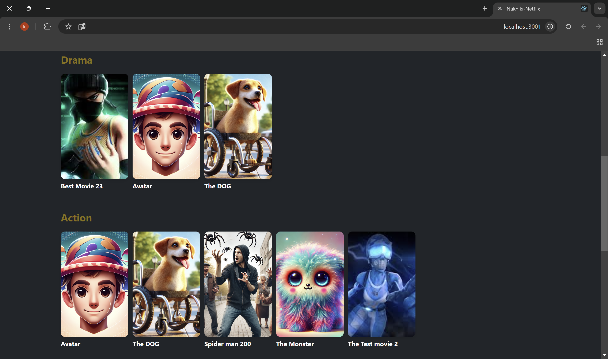
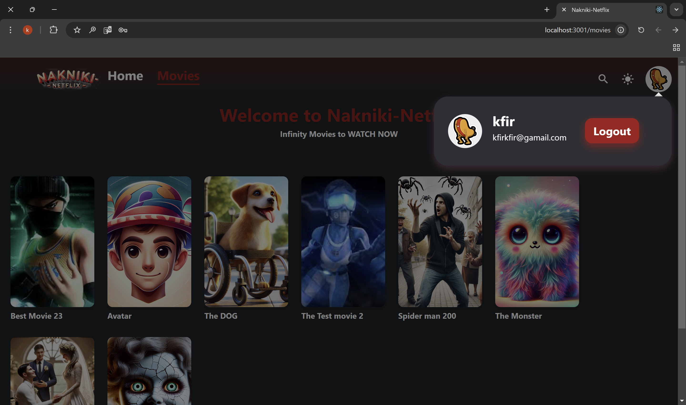
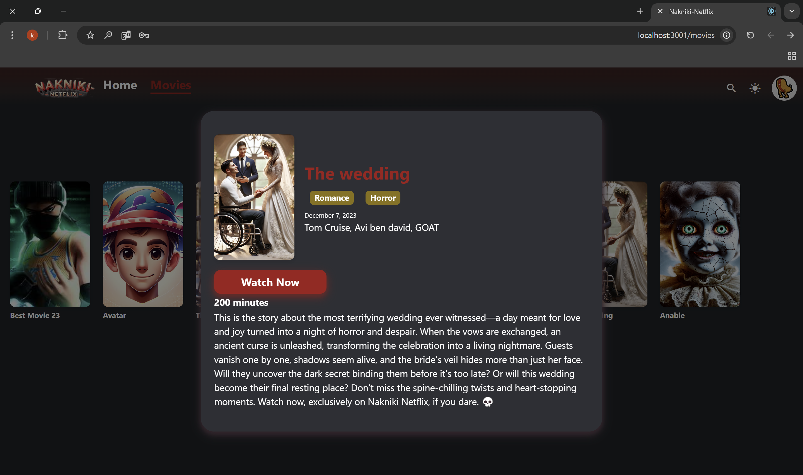
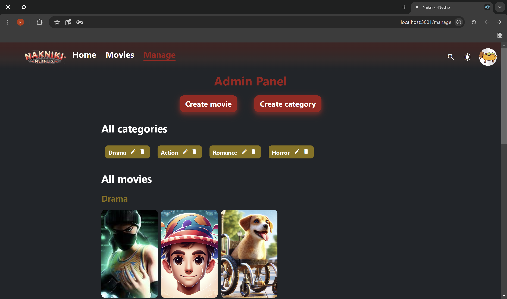
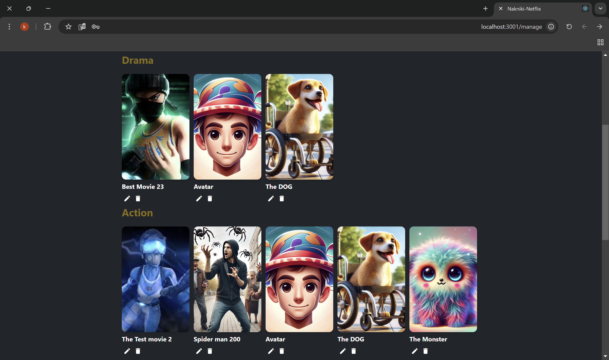

# Nakniki-Netflix Usage - Website

Welcome to **Nakniki-Netflix**, a movie-streaming platform designed to provide a seamless user experience for browsing, managing, and watching movies.

This README will guide you through the setup, usage, and core functionalities of **Nakniki-Netflix**.

## Home Screen for unregster User

## User Registration and Login
This guide will walk you through the registration and login process on the Nakniki-Netflix website.

### Signup process
1. Launch the website.
2. Click on the **Signup** button on the main screen.
3. Fill out the registration form:  
   * **Choose an Avatar**
   * **Username**
   * **Email**
   * **Password**
4. Submit the form. 

* From here you will be transfer to the **Login** page.

note - if you already have an account you can move from here to the Login page.

### Login process
1. Launch the website.
2. Click on the **Login** button on the main screen.
3. Fill out the login form:
   * **Username**
   * **Password**
4. Submit the form. 

* From here you will be transfer to the **Home** page.

note - if you dont have an account you can move from here to the Signup page.

## Home page

After the user did the Login, he will enter the Home page for registers users.

In the top of the page there is an automatically player that plays a random movie and when the user scroll down there are movies that their categories are "promoted".  
In this page there is only "promoted" movies.

## Movies page

In this page you can see all the movies that exist in the website.

## User info

If the user click on the avatar in the navbar, a popup window will appear with the user avatar, username, email and a logout button. When the user click on the button the app will return to the unregister home page.

## Movie info

When the user click on the movie thumbnail, a popup window will appear that contain all the movie details with a WATCH NOW button that will open the movie itself.

## Movie Watch

After the user click on the WATCH NOW button a new window will appear with the movie player and the movie details.  
In this page the user can watch the movie and RELAX.

## Search Screen 

In the navbar there is an option to enter the search screen.  
In this screen the user can search for any movie that exist in Nakniki Netflix.  
The user can search movies by - 
* Movie's name.
* Actors.
* Date.
* Category.
* Movie's length.

## Admin panel

If the user that logged in define as "admin" so a new tab will appear in the navbar that called "MANAGE".  
In the **MANAGE** page the admin can create movies, categories edit them and also delete them.  

### Create Category

When the admin click the "Create category" a new popup screen will appear.  
There the admin will enter the category name and mark down if the category is promoted or not.

### Edit Category

When the admin click the pencil icon near the category a new popup screen will appear.  
There the admin will enter the category name and mark down if the category is promoted or not and it will update the chosen category.  
This popup window looks like the popup in the create category.

### Delete Category

When the admin click the trash icon near the category it will delete the chosen category.  

### Create Movie

When the admin click the "Create movie" a new popup screen will appear.  
There the admin will enter the movie details.
* Movie name.
* Movie published date.
* Movie Actors.
* Movie length.
* Movie description.
* Movie Categories (given the exists categories).
* Movie thumbnail.
* Movie file.

### Edit Movie

When the admin click the pencil icon near the movie a new popup screen will appear.  
There the admin will enter the movie name and all his details and it will update the chosen movie.  
This popup window looks like the popup in the create movie.

### Delete Movie

When the admin click the trash icon near the movie it will delete the chosen movie.  